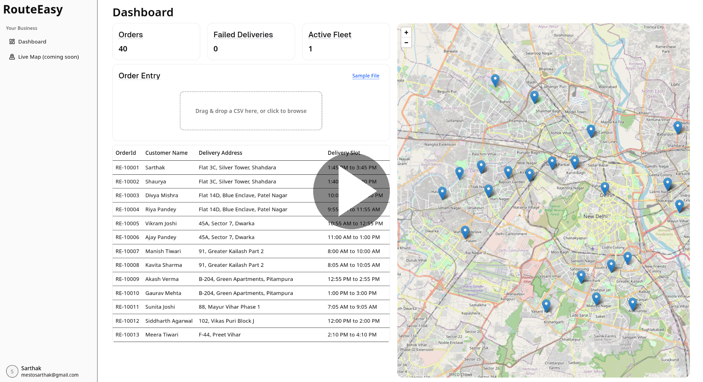
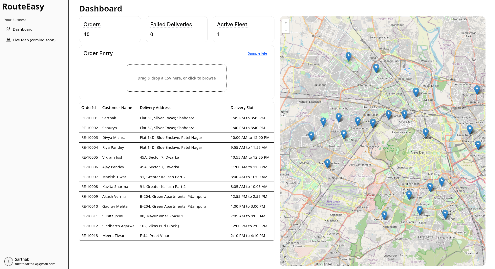
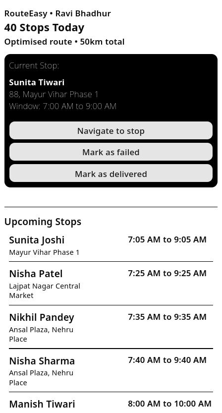

# RouteEasy 🛵

> **Last-mile delivery, finally fixed.**

[](https://github.com/Marky2813/routeeasy-teampenguin)
[](https://flask.palletsprojects.com/)
[](https://react.dev/)

---

## Raju Ki Kahani

Raju does 100 deliveries a day. He won't get paid for 10 of them.

Not because he didn't show up — he did. He rode out, burned fuel, and knocked on doors. But the customer wasn't home. No warning, no heads-up, just a failed attempt that goes uncompensated.

Raju isn't an edge case. Across India, lakhs of delivery agents face a **10–15% failed delivery rate daily**. Last-mile delivery accounts for **50% of total logistics costs**, and the single biggest reason it fails is trivially preventable: the customer isn't home.

RouteEasy fixes this — before Raju even leaves the warehouse.

---

## The Problem

India's last-mile delivery ecosystem is broken at a structural level:

- **Vague delivery windows** (9 AM – 9 PM) give customers no reason to stay home or plan ahead.
- **No communication loop** — riders arrive cold; customers are caught off-guard.
- **Static routes** — even when a customer cancels or reschedules, the rider's route doesn't update. He still goes there.
- **Unpaid failed trips** — riders absorb the cost of every missed delivery in time, fuel, and lost income.
- **Dense urban conditions** — Indian roads are complex and GPS data is often outdated or inaccurate.

These aren't edge cases. They're the daily reality for delivery operators processing hundreds of orders with no access to enterprise-grade logistics software.

---

## The Solution

RouteEasy is a **bidirectional, real-time delivery management system** that puts intelligence into the last mile.

Here's what happens when Raju's day starts with RouteEasy:

1. **The admin uploads the day's orders** — a simple CSV drop into the dashboard.
2. **Routes are optimized instantly** — the Solvice VRP engine computes the most efficient sequence accounting for real-world road networks via OpenStreetMap.
3. **Every customer gets a precise 2-hour window** — calculated from the rider's estimated arrival time, not a vague all-day range.
4. **WhatsApp notifications go out automatically** — each customer receives their window and can reply `Confirm` or `Reschedule`.
5. **If a customer reschedules, the route updates instantly** — the order is removed, the sequence is recalculated, and the rider's mobile view reflects the change in real time via SSE.
6. **Raju sees his optimized stop list on his phone** — no app install required, mobile browser is all he needs.

No wasted trips. No unpaid deliveries. A smarter route, happier customers, and more money in Raju's pocket.

---

## Who Benefits

| Stakeholder | How RouteEasy Helps |
|---|---|
| **Delivery Riders** | Fewer failed trips, more paid deliveries, less fuel wasted |
| **Logistics Operators / Admins** | Full order visibility, live map, lower failed delivery rates |
| **Customers** | Precise delivery windows, ability to reschedule in one WhatsApp message |
| **Local Logistics SMBs** | Enterprise-grade route intelligence without enterprise costs |

The immediate target market is the thousands of local logistics operators in India processing 200–500 orders per day who currently rely on spreadsheets and guesswork.

---

## Demo

<!-- Replace the link below once the product video URL is available -->
> 📹 **Product Video:** *[](https://youtu.be/ab0htP9xb6E)*

**Screenshots:**

| Admin Dashboard | Rider View (Mobile) |
|---|---|
|  |  |

---

## Features

### Route Optimization
Orders are solved as a Vehicle Routing Problem (VRP) using the [Solvice API](https://solvice.io), with OpenStreetMap as the underlying routing engine. The algorithm accounts for package weight (load capacity), handshake duration at each stop (5 minutes by default), and shift start/end times.

### Proactive Customer Scheduling
Once a route is solved, each order is assigned an `arrival` timestamp. A precise 2-hour delivery window (`arrival ± 1 hour`, rounded to the nearest 5 minutes) is calculated and sent to the customer via WhatsApp.

### WhatsApp Notifications
Notifications are sent via [TextMeBot](https://textmebot.com/) and include the customer's delivery window along with simple reply instructions. This runs in development on TextMeBot's trial. For production deployment, the same flow can be migrated to the WhatsApp Business API for scale and reliability.

### Bidirectional Rescheduling
Customers reply directly to the WhatsApp message:
- `Confirm` → delivery confirmed, rider proceeds as planned.
- `Reschedule` → the order is cancelled server-side, and the rider's route recalculates instantly.

The system matches incoming messages to the correct pending order by phone number, handles multiple orders per customer correctly, and sends a confirmation reply automatically.

### Real-Time Rider Updates via SSE
Route changes are pushed to the rider's frontend using **Server-Sent Events (SSE)** — no polling, no manual refresh. The rider always sees the current state of their route without any manual intervention.

### Admin Dashboard
A React-based web dashboard lets the operations team:
- Drag-and-drop CSV upload for bulk order entry
- View all orders in a sortable, filterable table (order ID, customer, address, delivery slot, status)
- See all stops plotted live on a map with geocoded markers
- Monitor fleet status (active riders, failed deliveries, total orders)

### Rider Mobile View
A lightweight, mobile-optimised view shows the rider:
- Total stops and estimated route distance for the day
- Current delivery card with customer name, address, and time window
- Action buttons: **Navigate to stop**, **Mark as failed**, **Mark as delivered**
- Upcoming stops list with time windows

---

## Tech Stack

### Frontend
| Technology | Purpose |
|---|---|
| React + Vite | UI framework and dev build tooling |
| Tailwind CSS | Utility-first styling |
| shadcn/ui | Accessible UI component library |
| SSE (native browser) | Real-time route update listener |

### Backend
| Technology | Purpose |
|---|---|
| Python + Flask | REST API server |
| Flask Blueprints | Modular route organisation |
| Flask-CORS | Cross-origin request handling |

### External APIs & Services
| Service | Purpose |
|---|---|
| [Solvice API](https://solvice.io) | Vehicle Routing Problem (VRP) optimisation |
| Google Geocoding API | Address → coordinates resolution |
| OpenStreetMap (via Solvice) | Real-world road network routing |
| [TextMeBot](https://textmebot.com/) | WhatsApp message delivery (dev/trial) |

---

## Architecture

```
┌─────────────────────────────────────────────────────────┐
│                     Admin Dashboard                     │
│              (React + Vite + Tailwind + shadcn)         │
└───────────────────────┬─────────────────────────────────┘
                        │ CSV Upload / REST API calls
                        ▼
┌─────────────────────────────────────────────────────────┐
│                   Flask REST API                        │
│                                                         │
│  POST /api/orders  →  Solvice VRP  →  Assign arrivals   │
│  GET  /api/rider   →  Optimised stop list               │
│  GET  /api/order/get/status  →  SSE stream              │
│  POST /api/webhook →  Incoming WhatsApp messages        │
│  GET  /api/notify/orders  →  Send WhatsApp via TMB      │
└───────┬─────────────────────────┬───────────────────────┘
        │                         │
        ▼                         ▼
┌───────────────┐        ┌────────────────────┐
│  Solvice API  │        │     TextMeBot API   │
│  (VRP Solve)  │        │  (WhatsApp Notify)  │
└───────────────┘        └────────────────────┘
                                  │
                                  ▼
                        ┌──────────────────────┐
                        │  Customer (WhatsApp) │
                        │  Confirm/Reschedule  │
                        └──────────┬───────────┘
                                   │ Webhook POST
                                   ▼
                        ┌──────────────────────┐
                        │  Cancel order →      │
                        │  Re-solve route →    │
                        │  SSE push to rider   │
                        └──────────┬───────────┘
                                   │
                                   ▼
                        ┌──────────────────────┐
                        │   Rider Mobile View  │
                        │   (React, browser)   │
                        └──────────────────────┘
```

---

## Getting Started

### Prerequisites

- Python 3.10+
- Node.js 18+
- A [Solvice API](https://solvice.io) key
- A [Google Cloud](https://console.cloud.google.com) project with the Geocoding API enabled
- A [TextMeBot](https://textmebot.com/) account and API key

### Environment Setup

Copy the example env file and fill in your keys:

```bash
cp .env.example .env
```

```env
SOLVICE_API_KEY=your_solvice_api_key
GOOGLE_GEOCODING_API_KEY=your_google_api_key
TMB_API_KEY=your_textmebot_api_key
```

### Backend

```bash
cd backend
pip install -r requirements.txt
python app.py
```

The API will start on `http://localhost:5000`.

### Frontend

```bash
cd frontend
npm install
npm run dev
```

The app will be available at `http://localhost:5173`.

---

## API Reference

### Orders

| Method | Endpoint | Description |
|---|---|---|
| `POST` | `/api/orders` | Upload order list (JSON array), triggers VRP solve and WhatsApp notifications |
| `GET` | `/api/orders/list` | Fetch all current orders with status and time windows |
| `GET` | `/api/rider` | Fetch the rider's optimised stop list |

### Order Status

| Method | Endpoint | Description |
|---|---|---|
| `GET` | `/api/order/cancel/<order_id>` | Mark an order as cancelled and broadcast via SSE |
| `GET` | `/api/order/complete/<order_id>` | Mark an order as completed |
| `GET` | `/api/order/fail/<order_id>` | Mark an order as failed |
| `GET` | `/api/order/get/status` | SSE stream — listen for real-time order status changes |

### Notifications & Webhook

| Method | Endpoint | Description |
|---|---|---|
| `GET` | `/api/notify/orders` | Send WhatsApp delivery window notifications to all pending orders |
| `POST` | `/api/webhook` | Receive incoming customer WhatsApp replies (Confirm / Reschedule) |

### Misc

| Method | Endpoint | Description |
|---|---|---|
| `GET` | `/api/health` | Health check |
| `GET` | `/api/solution` | Fetch the raw Solvice explanation for the last solved route |

---

## Order CSV Format

The admin dashboard accepts a CSV file. Each row should map to the following fields:

| Field | Type | Description |
|---|---|---|
| `orderId` | string | Unique order identifier (e.g. `RE-10001`) |
| `customerName` | string | Recipient's name |
| `phoneNumber` | string | WhatsApp-enabled phone number (e.g. `+91 9XXXXXXXXX`) |
| `deliveryAddress` | string | Full delivery address |
| `pincode` | integer | PIN code |
| `packageWeight` | float | Package weight in kg (used for load capacity) |
| `coordinates` | `[lat, lng]` | Optional — geocoded automatically if omitted |

A sample dataset (`seed.json`) with 40 Delhi-area orders is included in the repository for testing.

---

## Challenges

**GPS accuracy in Indian urban conditions** — Indian road networks are dense and GPS data is often inaccurate or outdated. RouteEasy routes via OpenStreetMap through Solvice, which handles this better than proprietary engines for India, but tuning delivery sequences in areas with poor coordinate data remains an ongoing challenge.

**Shrinking the delivery window** — Collapsing the industry-standard 9–12 hour vague slot down to a precise 2-hour window required careful handling of VRP arrival time outputs, rounding logic (to the nearest 5 minutes), and edge cases around last-minute reschedules that arrive too close to the current stop.

**Real-time sync without manual intervention** — Keeping the rider's live route in sync with customer rescheduling decisions — without any manual re-upload or re-solve — required combining the Solvice VRP solve loop with an SSE broadcast system so changes propagate from the webhook to the rider's screen in seconds.

---

## Future Scope

- **WhatsApp Business API** — migrate from TextMeBot for production-grade message volume and reliability without ban risk.
- **ML-based availability prediction** — use historical delivery patterns to predict customer availability by time of day and pin code, pre-empting failed trips before they happen.
- **Dynamic pricing** — let customers pay a premium for guaranteed time slots, creating a revenue stream while further reducing failed attempts.
- **Driver earnings dashboard** — give riders visibility into daily performance, income trends, and delivery stats.
- **Hyperlocal expansion** — extend the platform to restaurant and pharmacy deliveries where time sensitivity is even higher.
- **Multi-rider support** — the VRP model already supports multiple resources; the frontend can be extended for fleet-level dispatch.
- **Native mobile app** — replace the mobile browser experience with a dedicated app for better GPS and offline resilience.

---

## Built By

**Team Penguin** 🐧

---

*RouteEasy — because Raju deserves to get paid for every delivery he makes.*